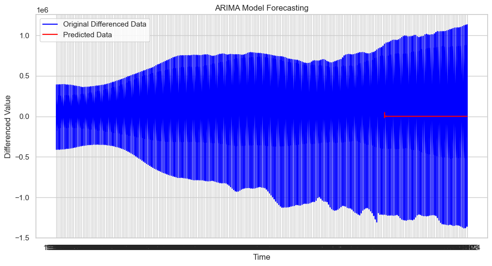

## Time series modelling on "Real Estate Investment Analysis: Identifying Top Zip Codes for Profit and Risk Management"

## Introduction

In this project, we aim to provide valuable insights and recommendations to a Fictional real estate investment firm. The firm is interested in identifying the top 5 best zip codes for potential real estate investments. This project involves leveraging historical data from the Zillow Research website, focusing on property prices.

## Business Understanding

The fictional real estate investment firm seeks to make informed investment decisions to maximize returns while managing risks. They are interested in diversifying their portfolio across various zip codes and are open to both short-term and long-term investment strategies. Understanding the local real estate market dynamics is crucial to their success.

##  Problem Statement

The primary problem statement is to determine the top 5 zip codes that offer the best investment opportunities for the firm. This involves considering factors such as profit potential, risk mitigation, and the investment horizon.

## Research Questions

To address the problem statement effectively, we will explore the following research questions:

1. What are the historical trends in property prices across different zip codes?
2. How does risk vary across these zip codes?
3. Can we identify zip codes that offer a balance between profit potential and risk mitigation?
4. What is the optimal time horizon for these investments, and how does it impact our recommendations?

## Main Objective

The main objective of this project is to provide the investment firm with data-driven recommendations for the top 5 zip codes to consider for real estate investments.

##  Specific Objectives

To achieve our main objective, we will pursue the following specific objectives:

1. Identify key financial metrics such as ROI and annualized growth rate for each zip code.
2. Evaluate the trade-off between profit potential and risk for each zip code.
3. Define the optimal time horizon for investment recommendations.

## Metric of Success

The success of this project will be measured by the following criteria:

- Identification of the top 5 zip codes for investment based on a balanced consideration of profit potential and risk.
- Clear and data-supported rationale for the chosen zip codes.
- Sensitivity analysis demonstrating the impact of different time horizons and risk tolerances on recommendations.
- A well-structured report or presentation that effectively communicates findings to the investment firm.

By addressing these objectives and metrics of success, we aim to provide the investment firm with actionable insights to guide their real estate investment decisions.
## Data Understanding
### Data Preprocessing

Before conducting any analysis,  performed the following preprocessing steps:

1. **Handling Missing Values:** Identified and addressed missing values in the dataset using appropriate techniques.
2. **Outlier Detection:** Detected and examined potential outliers that might impact our analysis.
3. **Data Types:** Checked and converted data types as needed for analysis (e.g., converting date columns to datetime format).
4. **Data Quality:** Ensured data quality by addressing any inconsistencies or errors in the dataset.

### Data Exploration

To gain initial insights into the data,  conducted exploratory data analysis (EDA). Key findings from the EDA include:

- Summary statistics for relevant columns.
- Visualization of property price and rental yield trends over time.
- Identification of regions with the highest and lowest property prices and rental yields.

### Data Limitations

It's essential to acknowledge the limitations of the dataset:

- Data Quality: Despite our preprocessing efforts, the dataset may still contain errors or inconsistencies.
- Time Period: The dataset covers a specific time range, which may not fully capture long-term real estate market trends.
- Regional Factors: External factors not included in the dataset, such as local economic conditions, can influence real estate markets.

### Data Sources

The primary data source for this project is the Zillow Research dataset.

Understanding the data and its limitations is a critical foundation for the subsequent analysis and recommendations in this project.
#### Arima model image

  
#### CONCLUSIONS
* Positive Long-Term Trend:  suggests that real estate has generally been a profitable investment over the years. This is a positive sign for potential real estate investors.
* Risk of Skewed Distributions:  there is a substantial variation in property values. While some areas may offer high returns, others may not be as lucrative.
* Market Variability: Real estate markets are highly localized, and different zip codes may experience varying degrees of growth or decline.
* Market Volatility: Outliers represent properties with values significantly different from the majority of properties, and their presence suggests that the market is experiencing extreme price fluctuations. 
* Investment Opportunities: While outliers may indicate increased volatility, they can also present investment opportunities. properties that are outliers in terms of high prices may represent potential high-end investments.
* Risk Assessment: High volatility can introduce uncertainty, and it's important to have risk mitigation strategies in place, such as diversifying your real estate portfolio or thoroughly researching the local market
  
  ### RECOMMENDATIONS

* Top five zip code identified during the analysis  based on size rank include:
  * RegionID, RegionName, City,	State, Metro, CountyName							
  * 84654,	60657,	Chicago,	IL,Chicago,	Cook
  * 90668,	75070,	McKinney,	TX,	Dallas-Fort Worth,	Collin
  * 91982,	77494,	Katy,	    TX,	Houston	,Harris
  * 84616,	60614,	Chicago,	IL,	Chicago,Cook
  *	93144,	79936,	El Paso,	TX,	El Paso	,El Paso	
* Investment Focus: Allocate a significant portion of the firm's investment budget to properties in the top 5 performing zip codes. These areas have a proven track record of appreciation.

* Diversification: While focusing on top-performing areas, also maintain a diversified portfolio. Don't put all investments into one region or zip code to mitigate risk.

* Market Timing: Consider market timing strategies. For example, if there are clear seasonal trends, the firm can strategically time property acquisitions and sales to maximize returns.

* Metro Area Strategy: Develop a strategy for each metro area. Some areas may be more suitable for long-term investments, while others may offer short-term gains. Tailor the approach accordingly.
  
  ### PRESENTATION PDF LINK   :
* https://www.canva.com/design/DAFuoElukvQ/uvcgH1HumXr4g0vI5FvhuQ/edit?utm_content=DAFuoElukvQ&utm_campaign=designshare&utm_medium=link2&utm_source=sharebutton